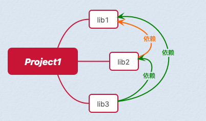
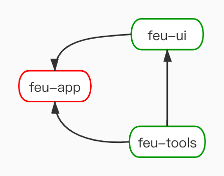
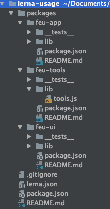
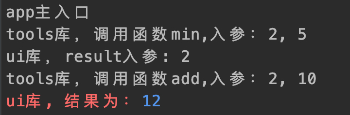
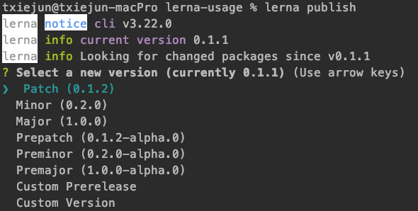
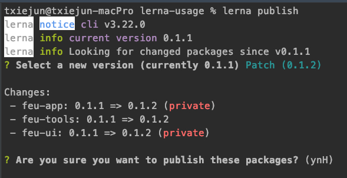
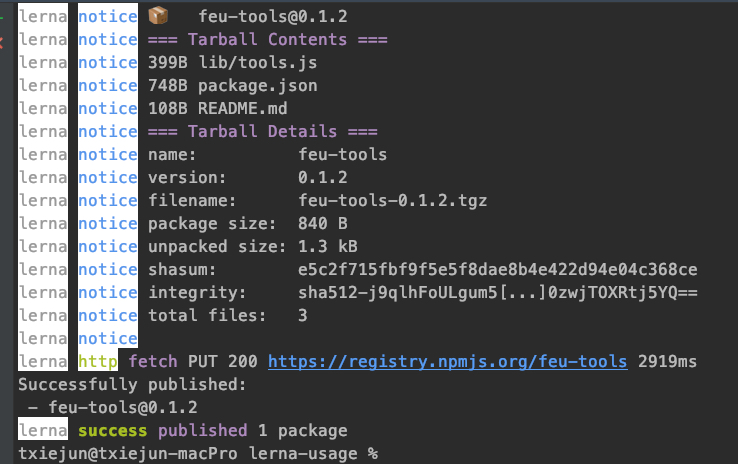

# lerna多项目管理实践

## 背景

我们在开发一个大型项目的时候，通常会遇到如下情况：  
一个业务工程Project1，会同时依赖于lib1、lib2、lib3，其中lib2又依赖于lib1，lib3又依赖于lib1和lib2这种复杂依赖情况。（lib1,lib2,lib3是自己开发维护的npm包，分别发布到私有服务器，我们称为自研依赖库，以区别第三方依赖库）。  
  

**如何组织管理这些依赖包是个问题**  

**方式1：** （Multirepo）多个依赖包独立进行git管理，问题也很明显，就是每个库有改动后，需要发布到线上，然后再去安装才能使用。如果是开发环境下，这个时候需要本地打包这样的操作就更加复杂了，这样如果依赖关系越复杂就越难以维护。

**方式2：** （Monorepo）反过来，如果所有依赖库完全放入一个项目工程的话，又不便于共同代码的复用和分享。

## lerna

> 用于管理具有多个包的JavaScript项目的工具。

lerna官网：https://lerna.js.org/  
lerna文档：https://github.com/lerna/lerna#readme  

目前使用lerna进行多packages管理的明星仓库有：

- [babel/babel](https://github.com/babel/babel)
- [facebook/create-react-app](https://github.com/facebook/create-react-app)
- [vuejs/vue-cli](https://github.com/vuejs/vue-cli)
- [webpack/webpack-cli](https://github.com/webpack/webpack-cli)

**lerna管理的库文件结构如下：**  

```js
lerna-usage/
  package.json
  packages/
    package-1/
      package.json
    package-2/
      package.json
```

lerna的作用是，把多个项目或者模块拆分为多个packages放入一个git仓库进行管理。  
- 通过命令`lerna boostrap`自动解决packages之间的依赖关系，对于packages内部的依赖会直接采用symlink的方式关联过去。
- 通过命令`lerna publish`依赖`git`检测文件改动，自动发布，管理版本号。
- 根据git 提交记录，自动生成changelog

## 管理模式

`lerna`有两种管理模式，固定模式和独立模式

### 固定/锁定模式（默认）  

命令：`lerna init`   
固定模式通过`lerna.json`里的版本进行统一的版本管理。这种模式自动将所有packages包版本捆绑在一起，对任何其中一个或者多个packages进行重大改动都会导致所有packages的版本号进行升级。

### 独立模式

命令：`lerna init --independent`  

独立模式，init的时候需要设置选项`--independent`。这种模式允许使用者对每个package单独改变版本号。每次执行`lerna publish`的时候，针对所有有更新的package，会逐个询问需要升级的版本号，基准版本为它自身的package.json里面的版本号。  
这种情况下，`lerna.json`的版本号不会变化， 默认为`independent`。

## lerna.json
```js
{
  "version": "1.1.3",
  "npmClient": "npm",
  "command": {
    "publish": {
      "ignoreChanges": ["ignored-file", "*.md"],
      "message": "chore(release): publish",
      "registry": "https://npm.pkg.github.com"
    },
    "bootstrap": {
      "ignore": "component-*",
      "npmClientArgs": ["--no-package-lock"]
    }
  },
  "packages": ["packages/*"]
}
```
参数说明：
- `version` 当前库的版本号，独立模式下，此参数设置为`independent`
- `npmClient` 允许指定命令使用的client， 默认是`npm`， 可以设置成`yarn`
- `command.publish.ignoreChanges` 可以指定那些目录或者文件的变更不会被publish
- `command.publish.message` 指定发布时提交的消息格式
- `command.publish.registry` 设置npm包发布的注册地址
- `command.bootstrap.ignore` 设置执行`lerna bootstrap`安装依赖时不受影响的包
- `command.bootstrap.npmClientArgs` 指定在执行`lerna bootstrap`命令时传递给`npm install`的参数
- `command.bootstrap.scope` 指定那些包会受 lerna bootstrap 命令影响
- `packages` 指定包所在目录

## 使用

以下假设有三个packages:
- feu-app 模拟业务主项目，不需要发布npm包，依赖于feu-ui和feu-tools
- feu-ui 模拟ui库项目，不需要发布npm包，依赖于feu-tools
- feu-tools 模拟工具共享库，需要发布npm包

假如相互依赖关系如下：  


### 1、全局安装lerna  

```bash
$ npm install --global lerna
```

### 2、使用`git init`初始化一个项目仓库

```bash
$ git init lerna-usage && cd lerna-usage
```

### 3、执行lerna初始化
```bash
$ lerna init
```

此处用的是默认的固定模式。  
目前整个文件夹目录像下面这样：  
```js
lerna-usage/
  packages/
  package.json
  lerna.json
```

### 4、创建三个新的package (feu-app、feu-ui、feu-tools)
```js
$ lerna create feu-app && lerna create feu-ui && lerna create feu-tools
```

执行完以上代码整个文档目录结果如下：   


### 5、添加依赖并编码

#### feu-tools

在`packages/feu-tools/lib/tools.js`添加代码如下：  
```js
'use strict';

function add(a, b) {
	console.log("tools库，调用函数add,入参：%d, %d",a ,b)
    return a + b;
}
function min(a, b) {
	console.log("tools库，调用函数min,入参：%d, %d",a ,b)
    return Math.min(a, b);
}

module.exports = { add, min };
```

#### feu-ui

**步骤一：**  
为了防止其被发布到npm上，我们在其`package.json`中设置`"private"=true`。

**步骤二：**  
添加第三方依赖包"chalk"到`feu-ui`的开发依赖库中，执行如下命令：  
```bash
$ lerna add chalk --scope=feu-ui --dev
```

**步骤三**  
添加本地包`feu-tools`到`feu-ui`的依赖库中，执行如下命令：  
```bash
$ lerna add feu-tools --scope=feu-ui
```

> 本地包添加的时候，lerna命令会通过symlink的方式关联过去，可以理解为创建了一个快捷方式，这个对本地开发非常有用。

**步骤四**  
在`packages/feu-ui/lib/ui.js`添加代码如下：  
```js
'use strict';

const chalk = require('chalk');
const { add } = require('feu-tools');

function ui(result) {
    console.log("ui库，result入参:", result);
    console.log(chalk.red("ui库, 结果为："+chalk.blue(add(result, 10))));
}

module.exports = ui;
```

#### feu-app
**步骤一**  
为了防止其被发布到npm上，我们在其`package.json`中设置`"private"=true`。

**步骤二：**  
添加本地包`feu-tools`到`feu-app`的依赖库中，执行如下命令：
```bash
$ lerna add feu-tools --scope=feu-app
```

**步骤三**  
添加本地包`feu-ui`到`feu-app`的依赖库中，执行如下命令：  
```bash
$ lerna add feu-ui --scope=feu-app
```

**步骤四** 
在`packages/feu-app/lib/app.js`添加代码如下：  
```js
'use strict';

const { min } = require('feu-tools');
const ui = require("feu-ui");

function app() {
    console.log("app主入口");
    let minNum = min(2, 5);
    ui(minNum);
}

app();
```

### 6、运行效果

由于此时已经安装好了所有依赖包，所以不需要执行`lerna bootstrap`， 如果是新clone的一个已有的lerna工程，可以通过执行`lerna bootstrap`命令一键安装所有packages的依赖项。  
此时运行如下命令：
```bash
$ cd packages/feu-app && node lib/app.js
```

运行结果如下：



可以看到三个package之间以及第三方依赖库之间的调用已经成功执行。  
以上流程完整的展示了整个lerna的使用过程，如果没有发布和共享给其他团队使用的需求到此就可以结束了。  
如果我们还希望可以把`feu-tools`共享给其他团队和个人使用，那么我们就还需要把这这个包发布成npm包。

## 发布到npm

### 前置条件
- 如果是需要提前编译的项目，你可能需要通过`lerna run build `执行`build`命令生成打包。
- 发布之前，你需要保证相关代码都已经提交到git。
- 通过`lerna changed`查看有哪些更新的packages。
- 需要确保你的npm账号已经是登陆状态，否则可能发布失败。
- 保证你对需要发布的npm包具有相关发布权限。
- 在`lerna.json`中设置好正确的npm registry,比如`https://registry.npmjs.org/`。

### 执行发布命令
当一切准备就绪后，就可以执行以下命令：
```bash
$ lerna publish
```

此处根据我们选择的管理模式不同，提示问题可能有所不同。由于我们选择的是固定模式，所有packages的版本号都会根据`lerna.json`中的版本号进行更新。  
询问版本号界面如下： 
 

选择了版本号的下一步界面如下：  


我们可以看到三个packages的版本号都统一升级成了`0.1.2`，而且可以看到`feu-app`和`feu-ui`展示为`private`，说明不会被发布到npm。

### 执行结果  



可以看到已经提示发布成功。

## 常用命令

### lerna init

初始化一个lerna项目  
固定模式（默认）：`lerna init`  
独立模式：`lerna init ----independent`  

### lerna bootstrap

安装所有packages的依赖项并且连接本地包的交叉依赖项。

### lerna import

导入存在的包  
**案例1：**把路径为`~/Users/Product`的包导入到名为`utilites`的包里。  
```js
$ lerna import ~/Users/Product --dest=utilities
```

### lerna add

将本地或者远程的包作为依赖项添加到当前的packages中，每次只能添加一个包。  
**案例1：**添加远程依赖包"chalk"到`feu-ui`的开发依赖库中，执行如下命令：  
```bash
$ lerna add chalk --scope=feu-ui --dev
```

**案例2：**添加本地包`feu-tools`到`feu-app`的依赖库中，执行如下命令：  
```bash
$ lerna add feu-tools --scope=feu-app
```

### lerna create

创建一个lerna管理的package包

**案例1：**  
```bash
$ lerna create feu-tools
```

### lerna clean

删除所有包下面的`node_modules`目录，也可以删除指定包下面的`node_modules`。  
**注意：**不会删除`package.json`里面的依赖项定义，也不会删除root目录的`node_modules`。  

**案例1:**只删除`feu-ui`包下面的`node_modules`目录  
```bash
$ lerna clean --scope=feu-ui
```

### lerna ls

列出所有公开的包（排除`private=true`的）

### lerna changed

检查自上次发布以来有哪些包有更新。

### lerna diff

查看自上次发布以来的所有包或者指定包的`git diff`变化。

### lerna run

在包含该脚本命令的每个package内部执行`npm script`脚本命令,也可以指定在某个package下执行。  

**案例1：**在`feu-ui`包中执行`build`脚本命令
```bash
$ lerna run build --scope=feu-ui
```

### lerna exec

在每个包中执行任意命令，也可以指定在某个package下执行。  
**案例1：**  
```bash
$ lerna exec -- npm view \$LERNA_PACKAGE_NAME
```

### lerna link

将相互依赖的所有包Symlink链接在一起。

### lerna version

版本迭代。  
执行此命令，做了这几件事：  
- 标识自上个标记版本依赖有更新的包。
- 提示输入新版本。
- 修改包元数据以反映新版本，在根目录和每个包中运行适当的生命周期脚本。
- 提交这些改动并标记提交。
- 推送到git远端。

**版本更新原则：**  
- 存在feat提交： 需要更新minor版本
- 存在fix提交： 需要更新patch版本
- 存在BREAKING CHANGE提交： 需要更新大版本

### lerna publish

发布需要发布的包，此命令可以既包含`lerna version`的工作，也可以单纯的只做发布操作。

根据不同的管理模式行为会不太一样。参考`管理模式`章节。  
**注意：**不会发布标记为私有（`package.json`中`private=true`）的包。

#### `lerna publish`
发布自上次发布以来有更新的包，包含了`lerna version`的工作。

#### `lerna publish from-git`
显示发布当前提交中标记的包，类似于先独立执行`lerna version`后，再执行此命令进行发布。

#### `lerna publish from-package`
显示发布npm registry中不存在的最新版本的包。

## 其他事项

### 以@开头包的发布问题

发布package的名字如果是以@开头的，例如`@feu/tools`，npm默认以为是私人发布，需要使用`npm publish --access public`发布。但是`lerna publish`不支持该参数，解决方法参考: [issues](https://github.com/lerna/lerna/issues/914)

方案参考：  
```json
// package.json
{
 "name": "@feu/tools",
 "publishConfig": {
   "access": "publish" 	// 如果该模块需要发布，对于scope模块，需要设置为publish，否则需要权限验证
  }
}
```

### lerna发布失败后的解决方案

你可以在你这次失败之后使用`lerna publish from-git`从上次版本迭代的结果开始发布。  
参考：https://github.com/huruji/blog/issues/67

### 配置使用yarn useWorkspaces

命令：`lerna bootstrap --npm-client yarn --use-workspaces`  
或者`lerna.json`里配置：  
```js
// lerna.json
{
  "packages": ["packages/*"], // 配置package目录
  "npmClient": "yarn",
  "useWorkspaces": true // 使用yarn workspaces
}
```

### 按拓扑排序执行命令

```bash
$ lerna run --stream --sort build
```

### Conventional Commits支持

lerna的`lerna version`和changelog生成都依赖于Conventional Commits。需要保证commit msg符合规范。  

相关文档：
- https://www.conventionalcommits.org/en/v1.0.0/
- https://juejin.im/post/5d0b3f8c6fb9a07ec07fc5d0


